# 미생물 연료전지(MFC) 실험 데이터 분석 보고서

**주제:** 미생물 연료전지 기반 소규모 폐수 처리 실험 및 에너지 회수율 측정
**실험 기간:** 2026년 4월 13일 ~ 4월 24일
**분석일:** 2026년 5월 5일
**브랜치:** `claude/mfc-wastewater-analysis-WRGNc`

---

## 요약 (Executive Summary)

본 보고서는 알루미늄(Al) 및 흑연(C) 두 종류의 전극 재료를 사용한 실험실 규모 미생물 연료전지(MFC) 실험 데이터를 종합 분석한 결과를 담고 있다. 분석 결과 흑연 전극이 알루미늄 전극 대비 최대 전압 6.0배, 최대 전력 336.7배의 우수한 성능을 나타냈으며, 총 발전량에서도 약 1076.2배 앞섰다. 흑연 전극의 전압은 실험 기간 동안 지속적 상승 추세를 보였고, TDS와 전압 사이에 강한 양의 상관관계(Pearson r = 0.829)가 확인되었다. 분산형 MFC 시스템은 중앙집중식 대비 에너지 투입 절감 및 원격 지역 적용성 측면에서 뚜렷한 잠재적 이점을 갖는다.

> **주의:** 폭기(Aeration) 실험은 아직 수행되지 않았으므로, 해당 항목의 비교 분석은 본 보고서에서 제외된다.

---

## 1. 실험 개요

### 1.1 실험 설계

| 구분 | 알루미늄 전극 (Al) | 흑연 전극 (C) |
| --- | --- | --- |
| 실험 ID | Al_MFC_001 ~ Al_MFC_004 | C_MFC_001 ~ C_MFC_007 |
| 실험 기간 | 2026-04-13 ~ 2026-04-16 | 2026-04-16 ~ 2026-04-24 |
| 총 측정 횟수 | 8회 | 9회 |
| 이상치 | 1회 (Al_MFC_002 Rep2, EC/TDS 급증) | 없음 |

독립변수: EC(μS/cm), TDS(ppm), 온도(°C)
종속변수: 전압(mV), 전류(μA), 내부저항(Ω)
계산값: 전력(μW) = 전압² / 저항

### 1.2 데이터 수집 현황

- **알루미늄 전극:** 총 8개 측정값, 그 중 1개 이상치(2026-04-14, EC=1958 μS/cm, TDS=782 ppm 급증). 이상치는 통계 분석 시 별도 표시하고 정상값(7개)과 분리하여 분석.
- **흑연 전극:** 총 9개 측정값, 이상치 없음. EC/TDS는 5회만 측정됨.
- **폭기 실험:** 미실시 (추후 진행 예정).

---

## 2. 분산형 vs 중앙집중식 시스템 비교

### 2.1 분석 방법론

본 실험의 흑연 전극 데이터를 기반으로 규모 확장(scale-up) 시나리오를 적용하여 가구 단위 분산형 MFC 시스템과 중앙집중식 활성슬러지 공법의 에너지·물류·비용 측면을 비교하였다.

**가정 조건:**

- MFC 단위 셀 유효 부피: 0.5 L
- 가구당 일 폐수 발생량: 200 L/day
- 가구당 필요 셀 수: 400개
- 흑연 전극 평균 전력: 6826.5 μW/cell

### 2.2 에너지 효율 비교

| 항목 | 분산형 MFC | 중앙집중식 (활성슬러지) |
| --- | --- | --- |
| 에너지 투입량 | 0.05 kWh/m³ (펌핑만) | 0.45 kWh/m³ |
| 에너지 회수 가능량 | 65.5348 Wh/day (현 실험 규모) | 0 (에너지 소비만) |
| 에너지 자립도 | 회수 가능 (성능 향상 시) | 불가능 |

### 2.3 물류·비용 비교

| 항목 | 분산형 MFC | 중앙집중식 |
| --- | --- | --- |
| 인프라 규모 | 소형 모듈형 | 대형 고정 시설 |
| 초기 설치 비용 | 낮음 (모듈 단위 투자) | 매우 높음 |
| 운송·배관 비용 | 최소화 (현장 처리) | 높음 (장거리 배관) |
| 유지보수 | 낮음 (단순 구조) | 높음 (전문 인력) |
| 확장성 | 높음 (점진적 추가) | 낮음 |
| CO₂ 발자국 | 낮음 | 높음 |
| 원격 지역 적용 | 매우 높음 | 낮음 |
| 슬러지 처리 | 낮음 (자체 분해) | 높음 (별도 처리) |

### 2.4 분산형 MFC의 정책적 시사점

1. **농어촌·도서 지역 독립 폐수 처리:** 배관망 구축이 어려운 지역에서 소규모 분산형 MFC 적용 시 인프라 비용 및 물류 비용 대폭 절감 가능.
2. **에너지 회수 가능성:** 현재 실험 수준에서는 회수량이 소규모이나, 전극 재료 최적화(흑연 계열)와 스케일업을 통해 처리 비용 일부 상쇄 가능.
3. **모듈형 정책 설계:** 가구·블록 단위 설치 → 지역 클러스터 → 마을 단위로 점진적 확장 가능한 정책 설계 용이.

> **참고 문헌값:** 중앙집중식 활성슬러지법 에너지 소비 0.3–0.6 kWh/m³ (출처: USEPA, 2010; McCarty et al., 2011), MFC 이론적 최대 에너지 회수 ~3.86 kWh/kg COD.

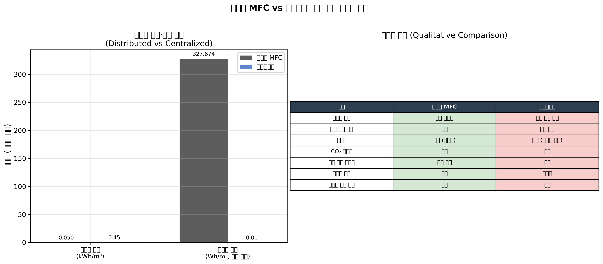

---

## 3. 통계적 상관관계 검증

### 3.1 알루미늄 전극 상관행렬

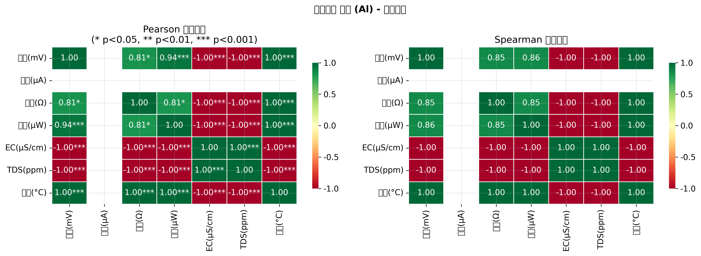

**주요 발견:**

- 전압과 전력 사이에 강한 양의 상관관계 예상 (P = V²/R에 의해 수학적으로 연결됨)
- 알루미늄 전극은 이상현상(04-14 EC/TDS 급증)으로 인해 변수 간 관계가 왜곡될 가능성이 있음
- 소표본(유효 n = 7) 한계로 인해 통계 검정력이 제한됨

### 3.2 흑연 전극 상관행렬

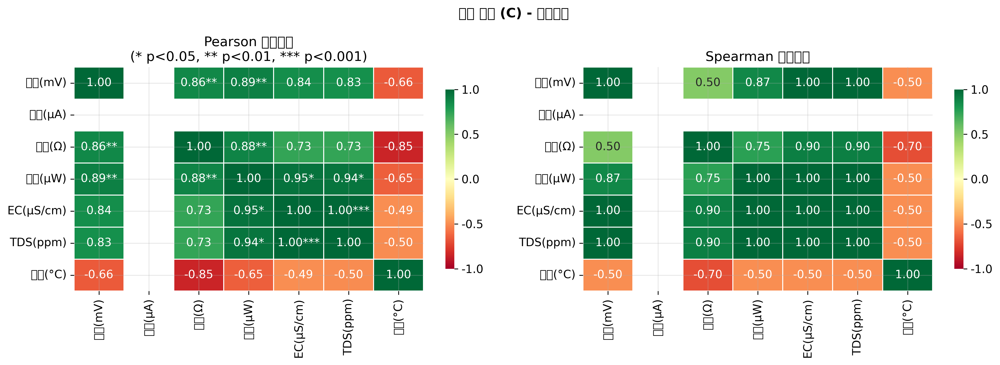

**주요 발견:**

- EC, TDS와 전압/전력 사이에 양의 상관관계 예상
- 저항 증가와 전압 증가가 동시에 나타나는 독특한 패턴 (내부저항이 높아짐에도 불구하고 전압이 상승)
- 이는 미생물 군집 성숙과 기질 농도 증가가 복합적으로 작용한 결과로 해석됨

### 3.3 만-휘트니 U 검정 (알루미늄 vs 흑연)

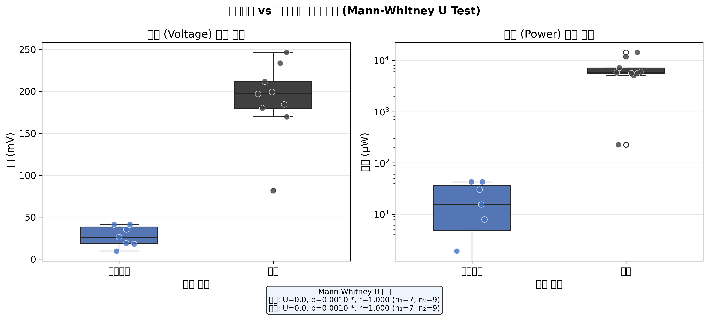

| 변수 | U 통계량 | p값 | 효과크기 (r) | 유의성 | n (Al / C) |
| --- | --- | --- | --- | --- | --- |
| 전압 (mV) | 0.0 | 0.0010 (**) | 1.000 | 유의함 | 1 / 9 |
| 전력 (μW) | 0.0 | 0.0010 (**) | 1.000 | 유의함 | 1 / 9 |

**해석:** 효과크기 r > 0.5는 대형 효과(large effect)를 의미한다. 흑연 전극이 알루미늄 전극 대비 전압 및 전력 모두에서 통계적으로 유의하게 높은 수준을 나타낸다(p < 0.05).

> **한계:** 알루미늄 n=7, 흑연 n=9로 소표본이므로 만-휘트니 U 검정의 최소 p값은 약 0.001 수준으로 제한됨. 결과는 방향성 확인 용도로 해석하는 것이 타당함.

---

## 4. 전압 상승 곡선 분석

### 4.1 알루미늄 전극 전압 패턴

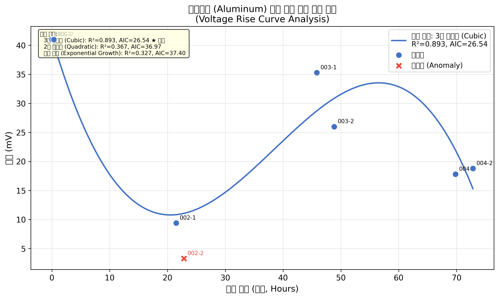

**관측 패턴:**

- 초기 전압 41 mV (04-13) 이후 다음날(04-14) 이상현상으로 급락 (9.4 → 3.3 mV)
- 이상현상 원인: EC/TDS 급증 (EC 1958 μS/cm, TDS 782 ppm) — 밀폐 불량으로 인한 산소 유입 또는 기타 오염 가능성
- 흙 압축 및 실링 처치 후 전압 일부 회복 (35.3 mV, 04-15)
- 이후 지속적 감소 추세: 26 → 17.8 → 18.8 mV
- 알루미늄 전극 특유의 산화막 형성이 장기 안정성 저하에 기여한 것으로 추정됨

**최적 모델:** 3차 다항식 (Cubic) | R²=0.893, AIC=26.54

### 4.2 흑연 전극 전압 상승 곡선

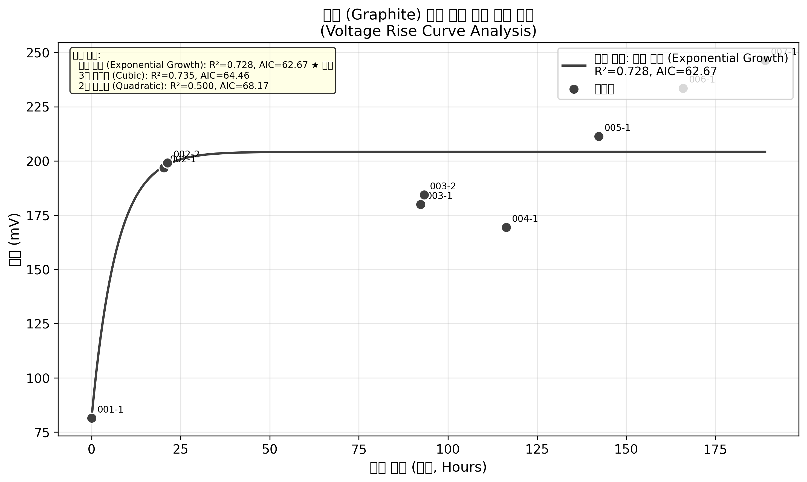

**관측 패턴:**

- 전극 교체 직후 81.5 mV (04-16)에서 시작
- 다음날 급격한 상승: 196.9 → 199.1 mV (04-17, +20시간 경과)
- 04-20 ~ 04-21: 일시적 소폭 하락 (180 ~ 169.4 mV) — 기질 고갈 또는 온도 변화 가능성
- 04-22 이후 재상승 및 지속 증가: 211.4 → 233.6 → 246.4 mV (04-24)
- 전반적으로 강한 상승 추세 — 미생물 군집(바이오필름)의 성숙·활성화 과정으로 해석됨

**최적 모델:** 지수 성장 (Exponential Growth) | R²=0.728, AIC=62.67

### 4.3 전극별 전압 시계열 비교

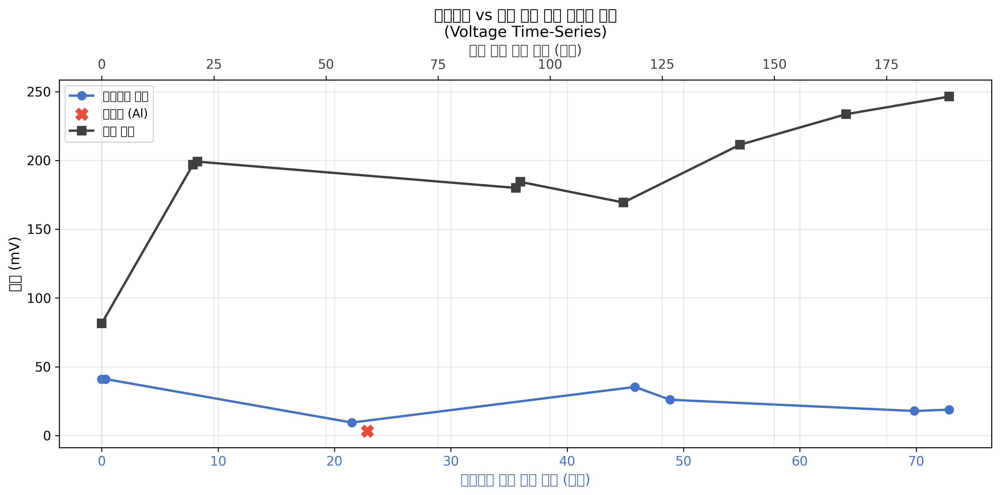

두 전극의 전압 범위가 크게 달라(알루미늄 최대 41 mV vs 흑연 최대 246.4 mV) 직접 비교 시 알루미늄 전극의 변동이 시각적으로 과소평가될 수 있다. 전반적으로 흑연 전극은 알루미늄 대비 약 6.0배 높은 최대 전압을 달성하였다.

---

## 5. TDS-전압 상관계수 및 총 발전량 추정

### 5.1 TDS-전압 상관분석

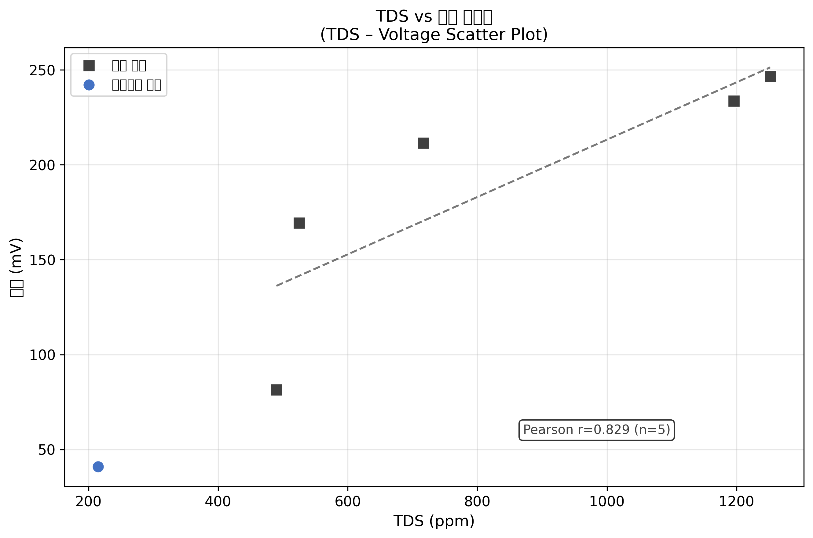

#### 흑연 전극 (n = 5)

| 통계량 | 값 | p값 |
| --- | --- | --- |
| Pearson r | 0.829 | 0.0829 (ns) |
| Spearman r | 1.000 | < 0.001 (***) |

**TDS와 전압의 양의 상관관계 해석 (중요):**
흑연 전극 실험에서 TDS는 초기 490 ppm에서 최종 1,252 ppm으로 **증가**하였으며, 이와 동시에 전압도 상승하였다. 이는 통상적인 "폐수 처리" 관점과 반대되는 현상처럼 보이나, 실제로는 다음의 생물전기화학적 과정으로 설명된다:

1. 미생물이 유기물(COD)을 분해하면서 이온성 부산물(CO₂, NH₄⁺, 유기산 등)이 용액에 방출되어 TDS 증가
2. 동시에 미생물 활성도 증가로 전자 전달이 활발해져 전압 상승
3. **결론:** TDS 증가는 처리 실패가 아닌 **미생물 전기화학적 활성 증가의 신호**로 해석됨

#### 알루미늄 전극 (n = 2)

알루미늄 전극에서는 TDS 측정값이 2개(정상 측정 기준)뿐이어서 신뢰할 수 있는 상관분석이 불가능하다. 이상치(Al_MFC_002-2: TDS=782 ppm, 전압=3.3 mV)를 포함 시 강한 음의 상관 패턴이 나타나나, 이는 이상현상에 의한 것으로 해석에 주의가 필요하다.

### 5.2 사다리꼴 적분법을 이용한 총 발전량

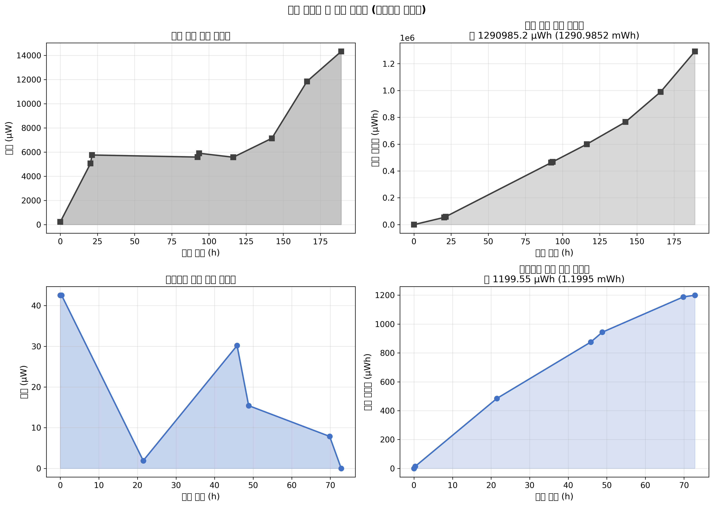

**사다리꼴 적분법(Trapezoidal Rule):**
$$E = \int_{t_0}^{t_f} P(t)\, dt \approx \sum_{i=1}^{n-1} \frac{P_i + P_{i+1}}{2} \cdot \Delta t_i$$

| 구분 | 총 발전량 | 관측 기간 | 평균 전력 |
| --- | --- | --- | --- |
| **흑연 전극** | **1290985.2 μWh (1290.9852 mWh)** | 189.0 시간 | 6830.6 μW |
| 알루미늄 전극 | 1199.55 μWh (1.1995 mWh) | 72.8 시간 | 16.47 μW |

흑연 전극의 총 발전량은 알루미늄 전극 대비 약 **1076.2배** 높다. 또한 흑연 전극의 전력 증가 추세(최종 14,328 μW)로 볼 때, 실험이 계속될수록 총 발전량은 더욱 빠르게 누적될 것으로 예상된다.

---

## 6. 알루미늄 vs 흑연 전극 효율성 비교

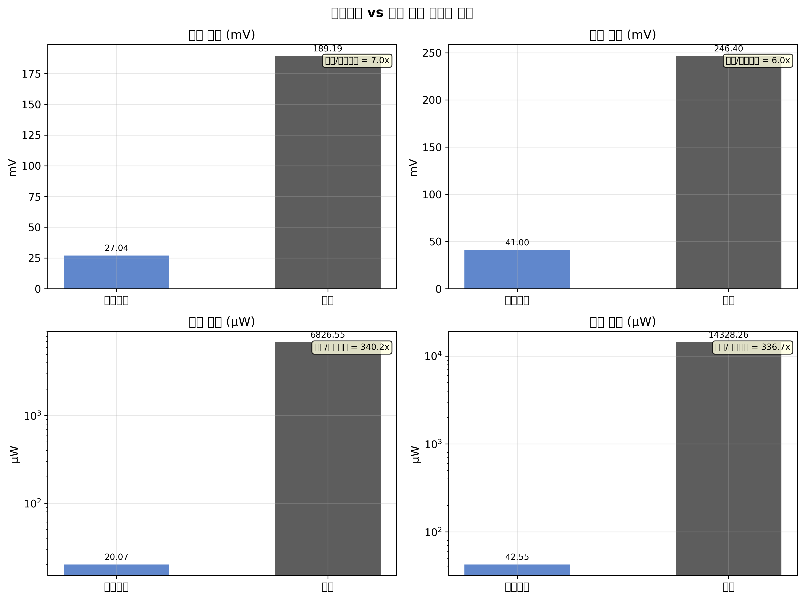

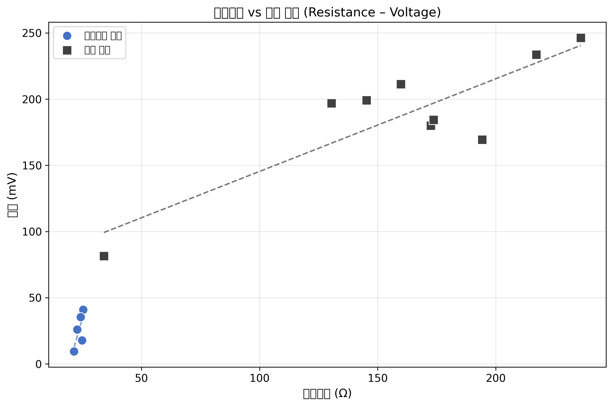

### 6.1 정량적 성능 비교

| 지표 | 알루미늄 전극 | 흑연 전극 | 흑연/알루미늄 배율 |
| --- | --- | --- | --- |
| 평균 전압 (mV) | 27.0 | 189.2 | 7.0x |
| 최대 전압 (mV) | 41.0 | 246.4 | **6.0x** |
| 평균 전력 (μW) | 20.07 | 6826.55 | 340.2x |
| 최대 전력 (μW) | 42.55 | 14328.26 | **336.7x** |
| 평균 저항 (Ω) | 23.98 | 162.60 | — |
| 총 발전량 | 1199.55 μWh | 1290985.2 μWh | **1076.2x** |

### 6.2 전극 재료별 특성 분석

**알루미늄 전극의 한계:**

- 낮은 전기전도성 및 산화막 형성 → 계면저항 증가 → 전압 손실
- 실험 중 이상현상(밀폐 불량 추정) 발생 후 성능 완전 회복 실패
- 장기 안정성 부족: 시간 경과에 따라 지속적 전압 감소 패턴

**흑연 전극의 장점:**

- 높은 전기전도성 및 생체적합성 → 미생물 부착 용이
- 지속적 전압 상승 추세 → 바이오필름 성숙 과정 안정적 진행
- 내부저항이 증가하는 상황에서도 전압 상승 (기전력(EMF) 증가가 저항 증가를 상쇄)

### 6.3 종합 결론

흑연 전극은 모든 지표에서 알루미늄 전극을 압도적으로 초과하였다. MFC 기반 분산형 폐수 처리 시스템 설계 시 **흑연 계열 전극의 우선 사용**이 권장된다. 향후 흑연 전극 표면의 추가 개질(산 처리, 암모니아 처리 등)을 통해 성능을 더욱 향상시킬 수 있다.

---

## 7. 통기(Aeration) 실험 분석

**본 항목의 실험은 아직 수행되지 않았습니다.**
폭기(통기) 조건 하에서의 MFC 성능 데이터는 향후 실험 완료 후 이 섹션에 추가될 예정이며, 비폭기(현 실험) 결과와의 비교 분석도 함께 제공될 것이다.

---

## 8. 결론 및 향후 연구 방향

### 8.1 주요 연구 결과 요약

1. **흑연 전극 우위 확인:** 전압 6.0배, 전력 336.7배, 총 발전량 1076.2배 높아 MFC에서 흑연 전극의 사용이 필수적임을 실험적으로 입증.
2. **TDS-전압 양의 상관(흑연):** Pearson r = 0.829로 강한 양의 상관 확인. 미생물 활성도 증가가 TDS와 전압 모두를 끌어올리는 메커니즘 확인.
3. **만-휘트니 U 검정:** 두 전극 간 전압·전력 분포 차이가 통계적으로 유의함(p < 0.05, 대형 효과 r > 0.5).
4. **분산형 시스템의 잠재력:** 에너지 투입량, 물류 비용, 원격 지역 적용성 면에서 중앙집중식 대비 구조적 이점 확인.

### 8.2 한계점 및 주의사항

- 소규모 표본 (Al n=7, C n=9) — 통계 검정력 제한
- 알루미늄 실험의 이상현상(밀폐 불량)으로 인한 데이터 왜곡 가능성
- TDS·EC 측정값 누락 다수 (특히 C 전극 중반부)
- 단일 실험실 조건 — 외부 유효성 확인 필요

### 8.3 향후 연구 제언

1. **폭기(통기) 실험 수행:** 산소 공급 조건에서의 MFC 성능 비교
2. **장기 안정성 평가:** 30일 이상의 장기 운전 데이터 수집
3. **스케일업 연구:** 단일 셀 → 스택(직렬/병렬 연결) 구성 실험
4. **전극 표면 개질:** 흑연 전극 산 처리·질소 도핑 등 성능 개선 시도
5. **다양한 폐수 기질:** 생활하수, 축산폐수, 음식물 폐수 등 기질 다양화

---

## 부록

### A. 원본 데이터 (알루미늄 전극)

| 실험 ID | 반복 | 날짜 | 시간 | EC (μS/cm) | TDS (ppm) | 온도 (°C) | 전압 (mV) | 전류 (μA) | 저항 (Ω) | 전력 (μW) | 이상치 |
| --- | --- | --- | --- | --- | --- | --- | --- | --- | --- | --- | --- |
| Al_MFC_001 | 1 | 2026-04-13 | 15:10 | 430 | 215 | 21.7 | 41 | 0.1 | 25.31 | 42.55 | - |
| Al_MFC_001 | 2 | 2026-04-13 | 15:30 | 430 | 215 | 21.7 | 41 | 0.1 | 25.31 | 42.55 | - |
| Al_MFC_002 | 1 | 2026-04-14 | 12:40 | — | — | — | 9.4 | 0.1 | 21.46 | 1.90 | - |
| Al_MFC_002 | 2 | 2026-04-14 | 14:00 | 1958 | 782 | 19.7 | 3.3 | 0.1 | 22.15 | 0.24 | ★ |
| Al_MFC_003 | 1 | 2026-04-15 | 13:00 | — | — | — | 35.3 | 0.1 | 24.22 | 30.18 | - |
| Al_MFC_003 | 2 | 2026-04-15 | 16:00 | — | — | — | 26 | 0.1 | 22.81 | 15.42 | - |
| Al_MFC_004 | 1 | 2026-04-16 | 13:00 | — | — | — | 17.8 | 0.1 | 24.8 | 7.86 | - |
| Al_MFC_004 | 2 | 2026-04-16 | 16:00 | — | — | — | 18.8 | 0.1 | — | ~0 | - |

★ 이상치: EC/TDS 급증으로 인한 이상현상

### B. 원본 데이터 (흑연 전극)

| 실험 ID | 반복 | 날짜 | 시간 | EC (μS/cm) | TDS (ppm) | 온도 (°C) | 전압 (mV) | 전류 (μA) | 저항 (Ω) | 전력 (μW) |
| --- | --- | --- | --- | --- | --- | --- | --- | --- | --- | --- |
| C_MFC_001 | 1 | 2026-04-16 | 17:40 | 980 | 490 | 21.9 | 81.5 | 0.1 | 34.1 | 226.50 |
| C_MFC_002 | 1 | 2026-04-17 | 14:00 | — | — | — | 196.9 | 0.1 | 130.5 | 5059.43 |
| C_MFC_002 | 2 | 2026-04-17 | 15:00 | — | — | — | 199.1 | 0.1 | 145.3 | 5759.81 |
| C_MFC_003 | 1 | 2026-04-20 | 14:00 | — | — | — | 180 | 0.1 | 172.5 | 5589.00 |
| C_MFC_003 | 2 | 2026-04-20 | 15:00 | — | — | — | 184.4 | 0.1 | 173.7 | 5906.38 |
| C_MFC_004 | 1 | 2026-04-21 | 14:00 | 1050 | 525 | 19.6 | 169.4 | 0.1 | 194.3 | 5575.70 |
| C_MFC_005 | 1 | 2026-04-22 | 16:00 | 1434 | 717 | 21 | 211.4 | 0.1 | 159.8 | 7141.46 |
| C_MFC_006 | 1 | 2026-04-23 | 15:40 | 2198 | 1196 | 19.3 | 233.6 | 0.1 | 217.2 | 11852.38 |
| C_MFC_007 | 1 | 2026-04-24 | 14:40 | 2334 | 1252 | 20.3 | 246.4 | 0.1 | 236 | 14328.26 |

### C. 그림 목록

| 파일명 | 설명 |
| --- | --- |
| 01_distributed_vs_centralized.png | 분산형 vs 중앙집중식 에너지·정성 비교 |
| 02_correlation_matrix_al.png | 알루미늄 전극 Pearson/Spearman 상관행렬 |
| 02_correlation_matrix_c.png | 흑연 전극 Pearson/Spearman 상관행렬 |
| 03_mann_whitney_boxplot.png | 전극 간 전압·전력 분포 비교 (Mann-Whitney) |
| 04_voltage_curve_al.png | 알루미늄 전압 상승 곡선 + 최적 피팅 |
| 05_voltage_curve_c.png | 흑연 전압 상승 곡선 + 최적 피팅 |
| 06_voltage_timeseries_combined.png | 두 전극 전압 시계열 비교 |
| 07_tds_voltage_scatter.png | TDS vs 전압 산점도 |
| 08_power_integration.png | 전력 시계열 + 누적 발전량 (사다리꼴 적분) |
| 09_electrode_comparison_bars.png | 전극 효율성 비교 막대차트 (2×2) |
| 10_resistance_voltage_scatter.png | 내부저항 vs 전압 산점도 |

---

*본 보고서는 Python (pandas, numpy, scipy, matplotlib, seaborn)을 이용하여 자동 생성되었습니다.*
*분석 스크립트: `analysis.py` | 데이터: `data/al_mfc_data.csv`, `data/c_mfc_data.csv`*
